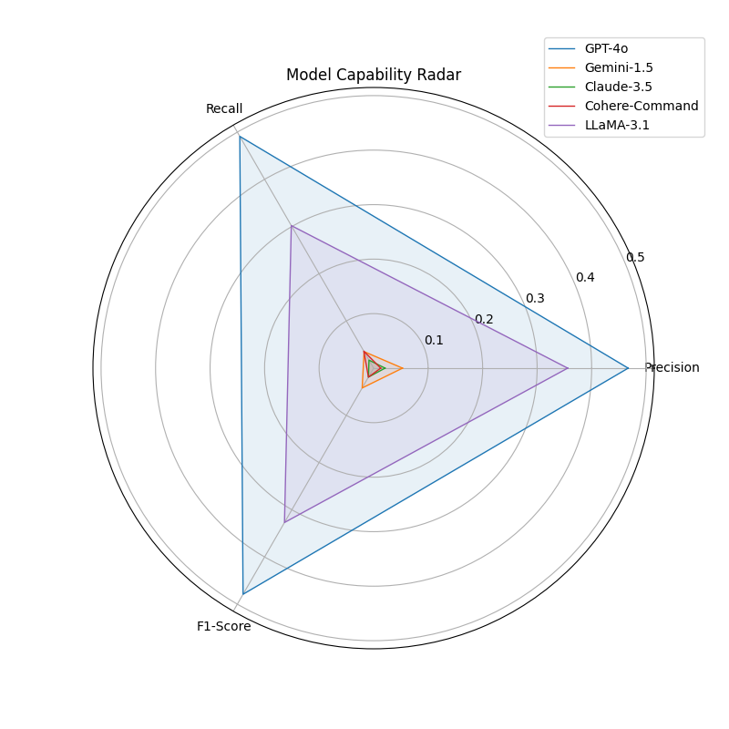

# AI-Based Academic Information Extraction & Model Comparison

## 📌 Overview
This project is an automated pipeline designed to extract structured **academic metadata** (Problem Statements, Methodologies, Keywords) from research paper abstracts. It leverages disparate **Large Language Models (LLMs)** to perform extraction and rigorously evaluates their performance against human-annotated ground truth.

## 🚀 Features
*   **Multi-Model Architecture**: Integrates **GPT-4o**, **Gemini 1.5**, **Claude 3.5**, **Cohere**, and **LLaMA 3.1**.
*   **Automated Evaluation**: Calculates **Precision**, **Recall**, and **F1-Score** using strictly matched keyword extraction.
*   **Data Visualization**: Generates Radar and Bar charts to visualize model strengths.
*   **Robust Error Handling**: Includes retry logic and fallback mechanisms for API stability.

## 📊 Performance Visualizations

## 🛠 Tech Stack
*   **Language**: Python
*   **Libraries**: `pandas`, `scikit-learn`, `matplotlib`, `google-generativeai`, `openai`, `anthropic`, `cohere`
*   **Input**: Excel Dataset (`.xlsx`)
*   **Output**: Structured CSV/Excel reports & Markdwon Analysis.

## ⚙️ How It Works
1.  **Input Phase**: The system accepts an Excel file containing academic abstracts.
2.  **Inference Phase**: Iterates through rows, prompting each LLM via API to extract specific fields in strict JSON format.
3.  **Evaluation Phase**: Parses the JSON output and compares extracted keywords against the 'Gold Values' column using a specialized token-overlap algorithm.
4.  **Reporting Phase**: compiling scores into a final comparative report.

## 🔒 Security Note
This repository contains the source code and logic. Data files and Private API Keys are excluded for security.

## 👨‍💻 Author
**[Agha Essa Khan]**
*Automated Information Extraction Researcher*
